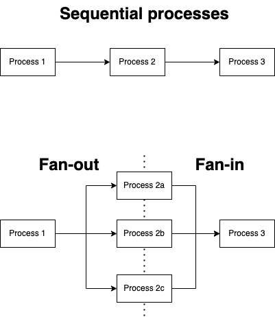

# Patterns

Here are examples of concurrency patterns.

## Fan Out and In

This pattern involves splitting a process into a sequence of processes into multiple concurrently running processes. Commuications between processes is based on Go channels. The output from one process is sent to multiple consuming process via Go channels. This is known as the Fan-Out pattern. When the output of multiple processes into a single process is known as the Fan-In pattern.

 

This [working example](../cmd/fan//main.go) demonstrates an implementation of a fan out pattern. In this example, a process reads a csv file, as each line is read, the items are sent to the next process via Go channels. The channel is then process by multiple processes categorising into Odds and Evens ID tags. The multiple channels are then consumed by a single process to format results of the categorisation.

NOTE: This example uses an unbuffered Go channel so for this implementation, we need to be careful not to spin up more categorisation processes than total number of jobs available. Otherwise, you could find Go concurrency deadlog.

## Publish Subscriber

This pattern involves three components:

* a publisher responsible for sending messages;
* a subscribe responsible for receiving messages;
* a broker to mediate between publishers and subscribers

This [working example](../cmd/pubsub/main.go) demonstrate this use of Go channels in publisher and subscriber pattern.

## Worker Pools

In other languages, a worker pool is intended to avoid spinning up unnecessary threads to process job. This does not apply to Go as the cost of spinning up Goroutine is minimal.

In Go worker pools are used to limit the number of concurrent processes at any one time to avoid overloading resources e.g. CPU core.

Here is a [working example](../cmd/workers/main.go) of a worker pool.